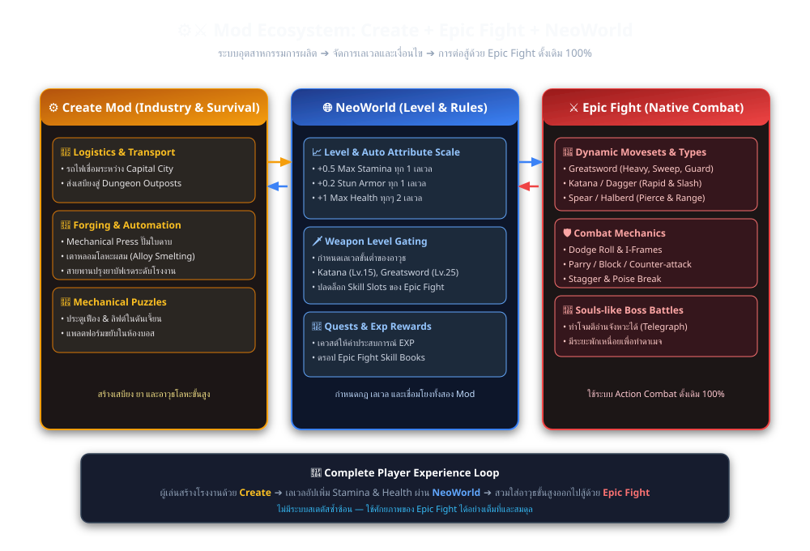
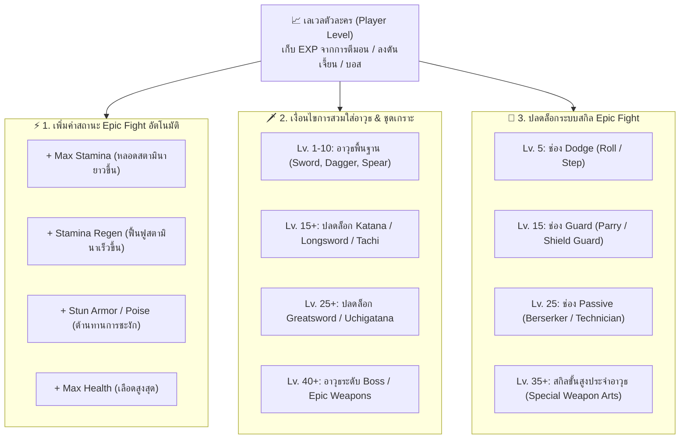
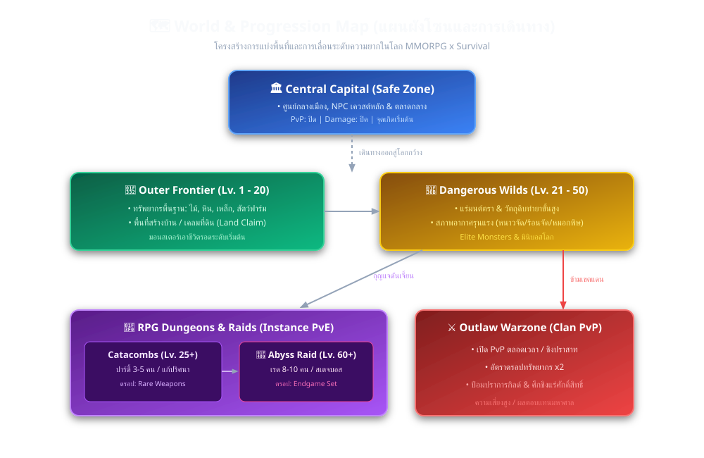
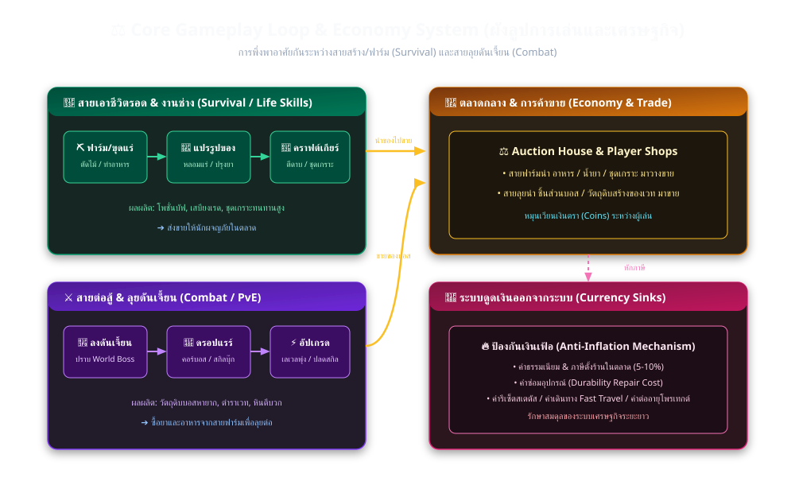
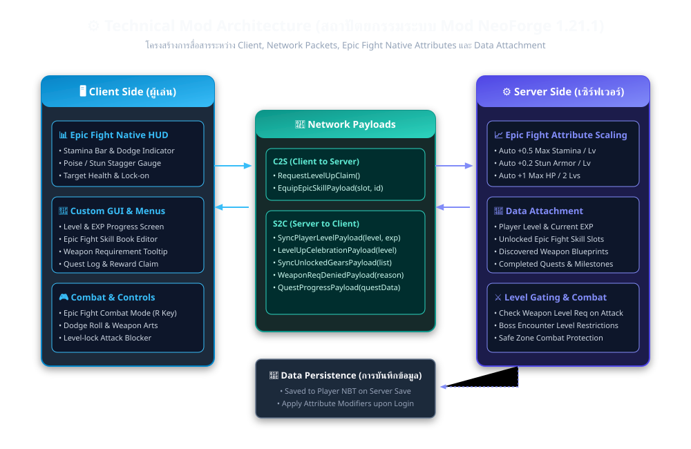
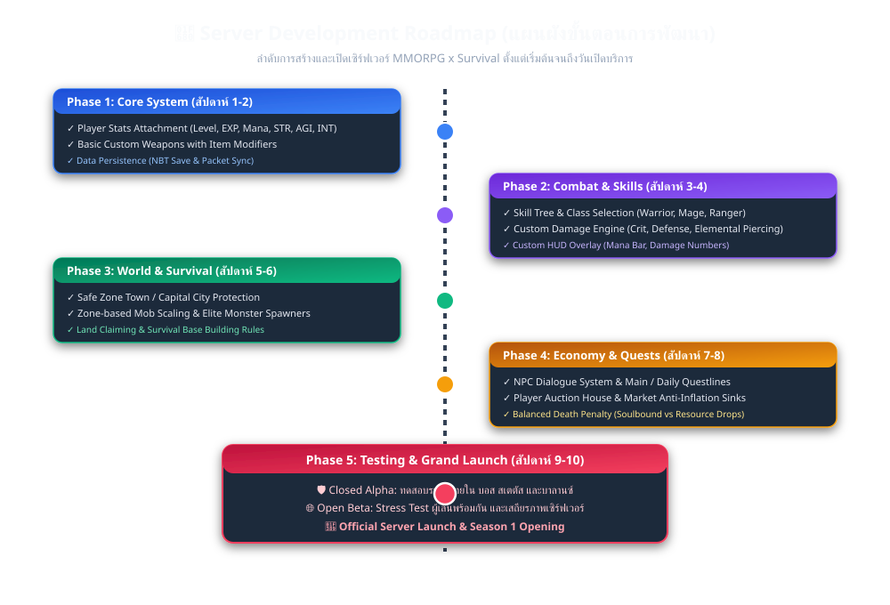

# 🌍 NeoWorld: MMORPG x Survival Architecture & Blueprint

> สถานะปัจจุบัน: เอกสารนี้เป็น blueprint และ roadmap ระบบที่ใช้งานแล้วระบุใน README.md
> โค้ดกำหนดเพดานเลเวลปัจจุบันเป็น 100; ตารางถึง Lv.50 ด้านล่างเป็นแนวคิดการบาลานซ์
> Attribute scaling, weapon/skill gating และรางวัลจากมอนสเตอร์ยังไม่เปิดใช้งาน

เอกสารสรุปสถาปัตยกรรม แผนผังระบบ และแนวทางการพัฒนาเซิร์ฟเวอร์แนว **MMORPG ผสม เอาชีวิตรอด (Survival)** สำหรับโปรเจกต์ `NeoWorld` บน **Minecraft NeoForge 1.21.1** ร่วมกับ **Create** และ **Epic Fight** (ใช้ระบบ Attribute & Skill ของ Epic Fight โดยตรง ไม่ทำระบบ Status แยก)

> [!TIP]
> คุณสามารถเปิดดูรูปภาพความละเอียดสูงทั้งหมดและดาวน์โหลดได้สะดวกผ่านไฟล์ [blueprints_viewer.html](diagrams/blueprints_viewer.html)

---

## 1. Mod Ecosystem Synergy (การทำงานร่วมกันของ Mod หลัก)

### ⚙️ Create Mod (หัวใจของ Survival & Industry):
* **Logistics & Transport:** ระบบรถไฟขนส่งมวลชนเชื่อมระหว่างเมืองหลวง (Safe Zone) ไปยังหมู่บ้านผู้เล่น และเขตหน้าด่านดันเจี้ยน
* **Advanced Forging:** การตีดาบ/ชุดเกราะด้วย Mechanical Press และเตาหลอมโลหะผสม (Alloy Smeltery)
* **Factory Automation:** ระบบผลิตน้ำยาขวดใหญ่ อาหารบัฟเรด และกระสุนแบบสายพานโรงงาน
* **Dungeon Mechanisms:** ประตูกลเฟือง ลิฟต์ และแท่นเหยียบขยับได้ในห้องเรดบอส

### ⚔️ Epic Fight Mod (หัวใจของ Action RPG Combat - Native 100%):
* **Custom Movesets & Animations:** ท่วงท่าการฟัน แทง ฟาด ตามประเภทอาวุธ (Greatsword, Katana, Spear, Dagger)
* **Dynamic Mechanics:** ระบบกลิ้งหลบ (Dodge Roll) พร้อม I-Frames, การป้องกันและการเคาน์เตอร์ (Parry / Guard), และระบบ Poise / Stagger Break
* **Skill Book System:** ใช้ระบบสกิลของ Epic Fight (Dodge, Guard, Passive, Mover, Identity Slots)
* **Souls-like Boss Fights:** บอสมีท่วงท่าการโจมตีที่คาดเดาได้ชัดเจน (Telegraphed Attacks) เพิ่มความท้าทาย

### 🌐 NeoWorld Core Mod (ตัวเชื่อมโยงระบบ):
* **Player Level Progression:** เก็บเลเวลและค่าประสบการณ์ EXP จากการต่อสู้ เควสต์ และดันเจี้ยน
* **Auto-Scale Epic Fight Attributes:** เพิ่มค่าพลังของ Epic Fight และ Vanilla อัตโนมัติเมื่อเลเวลอัป:
  - `epicfight:max_stamina` (+0.5 ต่อเลเวล)
  - `epicfight:stamina_regen` (+0.02 ต่อเลเวล)
  - `epicfight:stun_armor` (+0.2 ต่อเลเวล)
  - `minecraft:generic.max_health` (+1 HP ทุกๆ 2 เลเวล)
* **Weapon Level Gating:** กำหนดเลเวลขั้นต่ำในการใช้อาวุธและปลดล็อกช่องสกิลของ Epic Fight

---

## 2. ระบบเลเวลและเงื่อนไขการสวมใส่อาวุธ (Level & Gating Progression)

### ตารางการสเกลค่าพลังตามเลเวล:
| ระดับเลเวล | Max Stamina | Stamina Regen | Stun Armor | Max Health (HP) | การปลดล็อกอาวุธ & สกิล |
| :---: | :---: | :---: | :---: | :---: | :--- |
| **Lv. 1** | 15.0 | 1.00 | 0.0 | 20 (10 หัวใจ) | อาวุธหิน/ไม้, ดาบสั้น, มีด |
| **Lv. 10** | 20.0 | 1.20 | 2.0 | 25 (12.5 หัวใจ) | หอก, ดาบยาว, ปลดล็อก Dodge Slot |
| **Lv. 20** | 25.0 | 1.40 | 4.0 | 30 (15 หัวใจ) | คาตานะ (Katana), ปลดล็อก Guard/Parry Slot |
| **Lv. 30** | 30.0 | 1.60 | 6.0 | 35 (17.5 หัวใจ) | ดาบใหญ่ (Greatsword), ปลดล็อก Passive Slot |
| **Lv. 50 (ตัวอย่าง)** | 40.0 | 2.00 | 10.0 | 45 (22.5 หัวใจ) | อาวุธบอส Endgame & Weapon Arts ขั้นสูงสุด |

---

## 3. World & Progression Map (แผนผังโซนและการเดินทาง)

* **Safe Zone (Central Capital):** พื้นที่เกิด ศูนย์กลางการค้า ตลาดกลาง และจุดเปลี่ยนอาชีพ (PvP ปิด / Damage ปิด)
* **Outer Frontier (Lv. 1 - 20):** พื้นที่สร้างบ้าน โพรเทกต์ที่ดิน รวบรวมไม้ หิน แร่เหล็ก และสัตว์ฟาร์ม
* **Dangerous Wilds (Lv. 21 - 50):** สภาพอากาศแปรปรวน มอนสเตอร์ระดับสูง ดรอปแร่มนต์ตราและวัตถุดิบปรุงยา
* **RPG Dungeons & Raids (Lv. 25 - 60+):** ดันเจี้ยนแบบ Instance สำหรับปาร์ตี้ 3-10 คน และบอสขนาดใหญ่
* **Clan Warzone (PvP Territory):** พื้นที่สงครามกิลด์ ชิงปราสาท และแย่งชิงทรัพยากรคูณ 2

---

## 4. Core Gameplay Loop & Economy Flowchart (ลูปการเล่นและเศรษฐกิจ)

* **Survival & Life Skills:** ฟาร์ม ➔ แปรรูปด้วยเครื่องจักร Create ➔ คราฟต์โพชั่น/ชุดเกราะ/อาหารบัฟ นำไปวางขายในตลาดกลาง
* **Combat & PvE:** ลงดันเจี้ยน ➔ ดวล Boss ด้วย Epic Fight ➔ ได้รับวัตถุดิบหายาก/สกิลบุ๊ก นำมาแลกเปลี่ยนและซื้อเสบียงจากสายฟาร์ม
* **Anti-Inflation Sinks:** เก็บภาษีตลาดกลาง, ค่าซ่อมอุปกรณ์, ค่ารีเซ็ตสเตตัส และค่า Fast Travel เพื่อรักษาสมดุลเงิน

---

## 5. Technical Mod Architecture (สถาปัตยกรรม Modding - NeoForge 1.21.1)

* **Client Side:** Epic Fight Native HUD Overlay (หลอด Stamina, เกจ Stun), เมนู Level & EXP, Tooltip แจ้งเงื่อนไขเลเวลอาวุธ
* **Network Layer:** Custom Payloads ซิงค์ Level/EXP และแจ้งเตือนเมื่อใช้อาวุธที่เลเวลไม่ถึง
* **Server Side:** ระบบ Level Attachment, Auto Attribute Modifiers ซิงค์กับ Epic Fight และ Vanilla Attributes
* **Persistence:** ซิงค์ข้อมูลลง NBT อัตโนมัติเมื่อเซฟโลกหรือผู้เล่นสลับมิติ

---

## 6. Development Roadmap (แผนผังขั้นตอนการพัฒนา)

* **Phase 1: Core System (สัปดาห์ 1-2):** ระบบ Level & EXP Attachment, Auto Epic Fight Attribute Scaling, Weapon Level Gating
* **Phase 2: Combat & Skills (สัปดาห์ 3-4):** ปรับจูนแอนิเมชันอาวุธ Epic Fight, Skill Book Drops, Custom Level UI
* **Phase 3: World & Survival (สัปดาห์ 5-6):** ป้องกันเมือง, ระบบ Claim, โรงงาน Create สำหรับคราฟต์ไอเทม
* **Phase 4: Economy & Quests (สัปดาห์ 7-8):** ระบบเควสต์ NPC, ตลาดผู้เล่น, ระบบหักภาษีและ Death Penalty
* **Phase 5: Launch (สัปดาห์ 9-10):** Closed Alpha ➔ Open Beta ➔ Official Grand Launch
